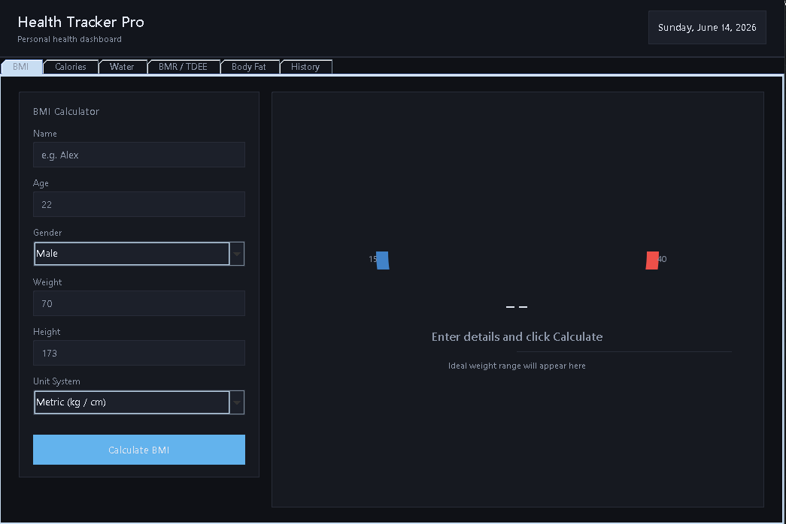
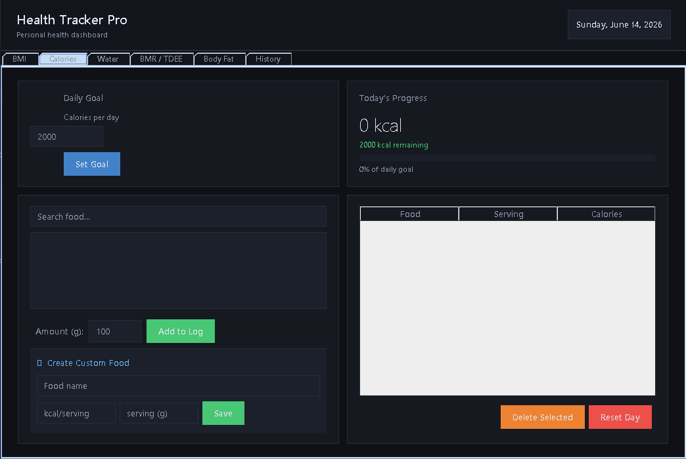
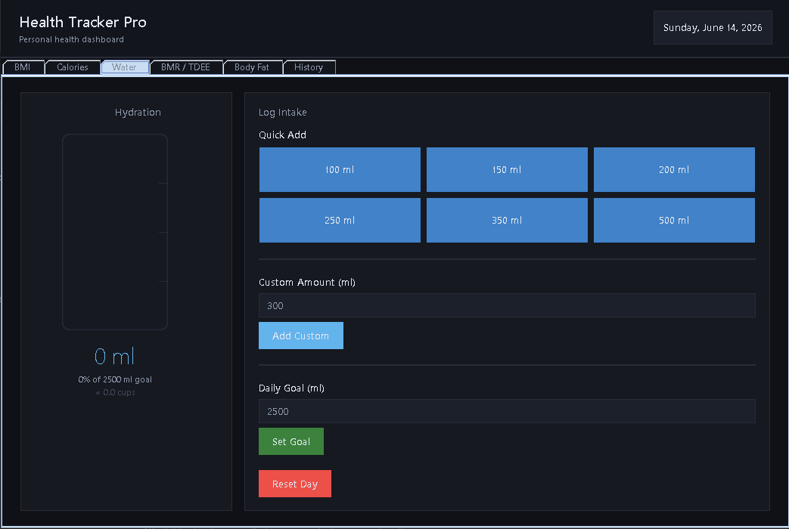
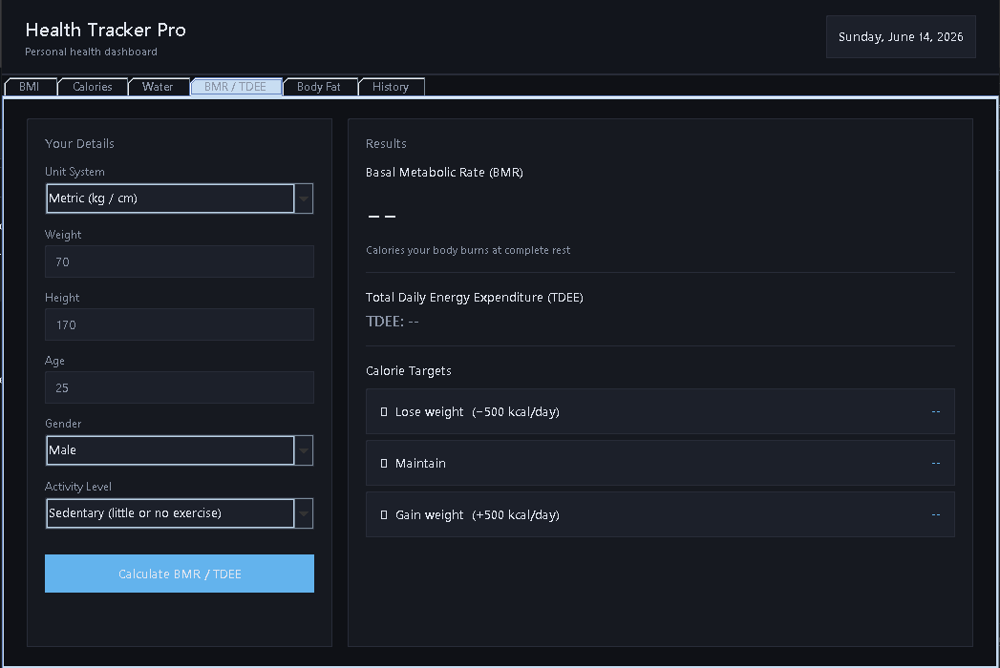
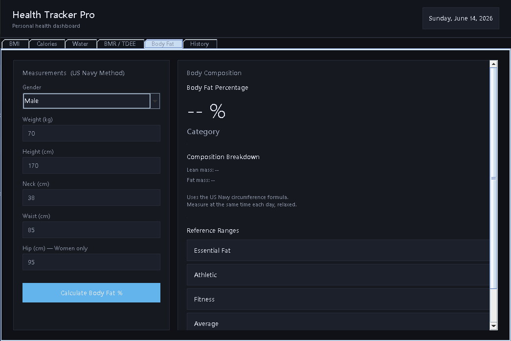
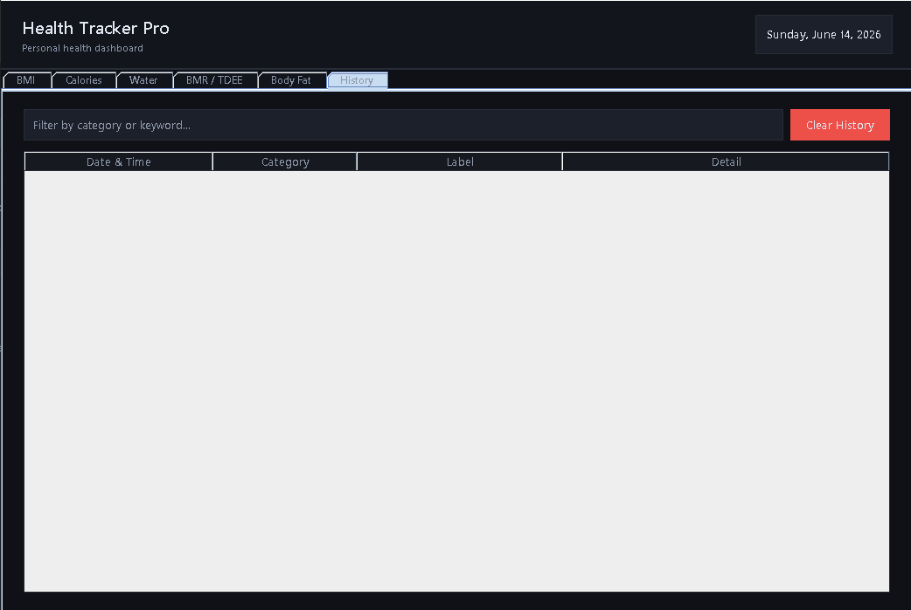

# Health Tracker Pro

A dark-themed personal health dashboard built with Java Swing and SQLite. Track your BMI, daily calories, water intake, BMR/TDEE, body fat percentage, and full health history — all in one desktop application.

---

## Download

A pre-built Windows installer is available — no Java installation required.

[Download HealthTracker-1.0.exe](https://drive.google.com/drive/folders/19Ha5CzkPoPBcb9xQPm4kOzjm8UaE20pq?usp=sharing)

> Compatible with Windows 10 and Windows 11.

---

## Screenshots

### BMI Calculator


### Calorie Tracker


### Water Tracker


### BMR / TDEE Calculator


### Body Fat Estimator


### History


---

## Features

### BMI Calculator
- Supports Metric (kg/cm) and Imperial (lbs/in) units
- Visual arc gauge with color-coded BMI category
- Displays ideal weight range based on gender and height
- Auto-fills BMR tab with the same values — no double entry
- Results logged to history automatically

### Calorie Tracker
- Searchable food database with 75+ built-in foods
- Add custom foods with your own calorie values
- Right-click a custom food to delete it
- Delete individual entries from the food log
- Set a custom daily calorie goal (persisted across sessions)
- Live calorie progress bar with consumed and remaining display
- Daily intake resets automatically at midnight

### Water Tracker
- Log water intake in ml
- Displays cups equivalent alongside ml
- Visual fill bar with wave animation
- Set a custom daily water goal (persisted across sessions)
- Daily intake resets automatically at midnight

### BMR / TDEE Calculator
- Mifflin-St Jeor formula for accurate BMR
- Supports Metric and Imperial units
- Activity level multiplier for TDEE
- Shows calorie targets for weight loss, maintenance, and muscle gain

### Body Fat Estimator
- U.S. Navy formula using neck, waist, and hip measurements
- Separate calculations for Male and Female
- Shows body fat percentage, category, lean mass, and fat mass

### History
- All calculations saved to a local SQLite database
- Live search and filter bar to find past entries
- Sorted newest first
- Persists between app sessions

---

## Tech Stack

| Technology | Purpose |
|---|---|
| Java 21 | Core language |
| Java Swing | Desktop UI framework |
| SQLite via sqlite-jdbc | Local persistent database |
| Apache NetBeans | IDE used for development |

---

## Getting Started

### Prerequisites

- Java JDK 21 or later — [Eclipse Adoptium](https://adoptium.net)
- Apache NetBeans IDE — [netbeans.apache.org](https://netbeans.apache.org)
- sqlite-jdbc JAR — [GitHub Releases](https://github.com/xerial/sqlite-jdbc/releases)

### Running in NetBeans

1. Clone this repository:
   ```bash
   git clone https://github.com/yourusername/HealthTracker.git
   ```
2. Open NetBeans and go to **File > Open Project**
3. Select the `HealthTracker` folder
4. Right-click the project and go to **Properties > Libraries**
5. Click **Add JAR/Folder** and add `sqlite-jdbc-x.x.x.jar`
6. Press **F6** to build and run

---

## Building a Windows Installer

The app can be packaged into a standalone Windows installer using `jpackage`. No Java installation is required on the target machine.

### Step 1 — Build the JAR in NetBeans

Press **F11** to clean and build. NetBeans outputs:

```
dist/HealthTracker.jar
dist/lib/sqlite-jdbc-x.x.x.jar
```

### Step 2 — Run jpackage

Open Command Prompt, navigate to your project folder, and run:

```cmd
"C:\Program Files\Eclipse Adoptium\jdk-21.0.11.10-hotspot\bin\jpackage" ^
  --type exe ^
  --name "HealthTracker" ^
  --app-version "1.0" ^
  --vendor "Jeremy Aragon" ^
  --description "Health Tracker Pro" ^
  --input dist ^
  --main-jar HealthTracker.jar ^
  --main-class HealthTracker.HealthTracker ^
  --icon HealthTracker.ico ^
  --win-shortcut ^
  --win-menu ^
  --win-dir-chooser ^
  --dest installer_output
```

> **Note:** `--type exe` requires [WiX Toolset 3.x](https://github.com/wixtoolset/wix3/releases) installed and added to PATH. Use `--type msi` as an alternative that works without WiX.

### Output

```
installer_output/
└── HealthTracker-1.0.exe
```

---

## Database

The app creates a SQLite database automatically at:

```
C:\Users\<YourName>\health_tracker.db
```

| Table | Description |
|---|---|
| `history` | All calculation logs |
| `custom_foods` | User-defined foods |
| `daily_state` | Persisted daily calorie, water, and goal values |

---

## Project Structure

```
HealthTracker/
├── src/
│   └── HealthTracker/
│       └── HealthTracker.java
├── screenshots/
│   ├── bmi.png
│   ├── calories.png
│   ├── water.png
│   ├── bmr.png
│   ├── bodyfat.png
│   └── history.png
├── dist/
│   ├── HealthTracker.jar
│   └── lib/
│       └── sqlite-jdbc-x.x.x.jar
├── installer_output/
│   └── HealthTracker-1.0.exe
└── README.md
```

---

## Planned Features

- [ ] Export history to CSV
- [ ] Weekly and monthly progress charts
- [ ] Meal planning tab
- [ ] Water intake reminders
- [ ] Light mode support

---

## Author

Jeremy Aragon

---

## License

This project is licensed under the [MIT License](LICENSE).
