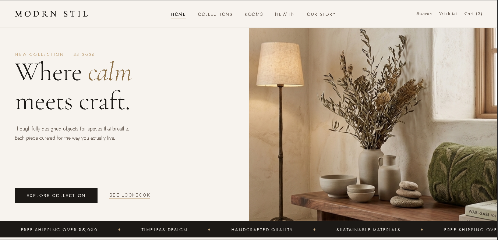

# MODRN STIL — Home Decor E-Commerce Website

A fully responsive, multi-page e-commerce front-end for a premium home decor brand. Built with vanilla HTML, CSS, and JavaScript — no frameworks, no dependencies.

🌐 **[Live Demo → modrn-stil.vercel.app](https://modrn-stil.vercel.app/)**



---

## Overview

MODRN STIL is a concept home decor shop inspired by wabi-sabi aesthetics and slow living. The project focuses on refined typography, warm earth tones, and smooth micro-interactions to deliver a boutique shopping experience.

---

## Pages

| Page | File | Description |
|------|------|-------------|
| Home | `index.html` | Hero section, featured products, brand stats, marquee strip |
| Collections | `modrn_stil_collections.html` | Full product grid with sidebar filters, sort, and view toggle |
| Rooms | `modrn_stil_rooms.html` | Room-based browsing experience |
| New In | `modrn_stil_new_in.html` | Latest arrivals |
| Our Story | `modrn_stil_our_story.html` | Brand narrative page |
| Search | `modrn_stil_search.html` | Site search interface |
| Wishlist | `modrn_stil_wishlist.html` | Saved items |
| Cart | `modrn_stil_cart.html` | Shopping cart |

---

## Features

- **Pixel-perfect design system** — consistent CSS custom properties for color, spacing, and typography across all pages
- **Procedural Canvas art** — product images and hero scenes drawn programmatically with the HTML5 Canvas API (no image assets required for the collections grid)
- **Real product photography** — hero and featured cards use actual product images (Arko Lounge Chair, Linen Throw Pillow Set, Wabi Pendant Lamp)
- **Sticky navigation** with active state indicators and smooth transitions
- **Filter & sort system** — category tabs, sidebar filters (price range slider, color swatches, material, availability), and sort dropdown
- **Animated entrance sequences** — staggered `fadeUp` and `fadeIn` keyframe animations on page load
- **Marquee strip** — continuously scrolling promotional banner
- **Fully responsive** — breakpoints at 1024px, 768px, and 480px with mobile-first layout adjustments

---

## Tech Stack

- **HTML5** — semantic markup, accessibility (`sr-only` labels)
- **CSS3** — custom properties, CSS Grid, Flexbox, keyframe animations, sticky positioning
- **Vanilla JavaScript** — Canvas 2D API, DOM manipulation, event handling
- **Google Fonts** — Cormorant Garamond (serif display) + Jost (sans-serif body)

---

## Design Tokens

```css
--cream:  #F7F3EE   /* page background    */
--warm:   #EDE5D8   /* card & section bg  */
--clay:   #C4A882   /* accent / labels    */
--dark:   #1C1916   /* text & nav bg      */
--mid:    #6B6057   /* secondary text     */
--accent: #8B6F47   /* CTA hover          */
```

---

## Project Structure

```
modrn-stil/
├── index.html
├── style.css
├── script.js
├── modrn_stil_collections.html
├── collections.css
├── collections.js
├── modrn_stil_rooms.html
├── modrn_stil_new_in.html
├── modrn_stil_our_story.html
├── modrn_stil_search.html
├── modrn_stil_wishlist.html
├── modrn_stil_cart.html
├── Arko_Lounge_Chair.png
├── Linen_Throw_Pillow_Set.png
├── Wabi_Pendant_Lamp.png
└── image.png
```

---

## Getting Started

View it live at **[modrn-stil.vercel.app](https://modrn-stil.vercel.app/)**, or run it locally — no build tools or package managers needed:

```bash
git clone https://github.com/your-username/modrn-stil.git
cd modrn-stil
open index.html
```

Or serve locally for best results:

```bash
npx serve .
# then visit http://localhost:3000
```

---

## Screenshots

| Home | Collections |
|------|-------------|
| Hero with product photography | Filter sidebar + procedural product grid |

---

## Author

Designed and built as a front-end portfolio project showcasing e-commerce UI patterns, CSS design systems, and creative use of the Canvas API.

---

## License

MIT — free to use as inspiration or a starting point for your own projects.
